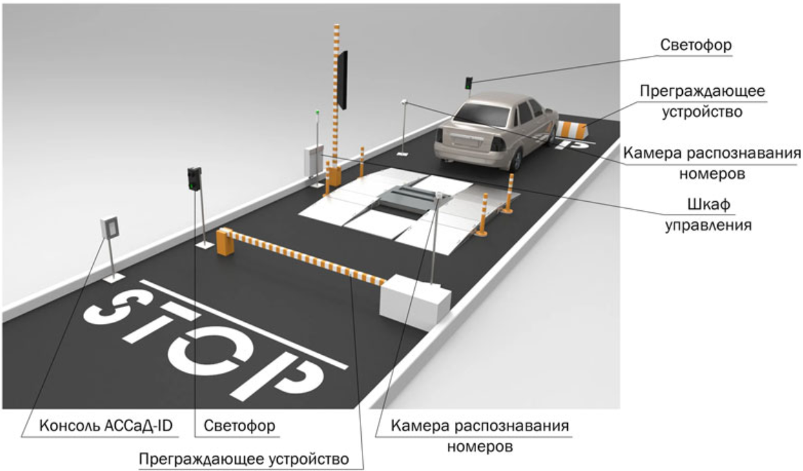

# Parking Access System
▎Интеллектуальная система управления доступом на парковку с распознаванием автомобильных номеров

Добро пожаловать в систему управления доступом на парковку. Этот проект предназначен для автоматизации процесса распознавания номерных знаков автомобилей и управления доступом через шлагбаум.

▎Описание проекта

Этот проект представляет собой интеллектуальную систему управления доступом на парковку, 
которая использует технологии компьютерного зрения и распознавания номерных знаков для автоматического открытия шлагбаума при въезде и выезде автомобилей.
Система интегрируется с базой данных разрешенных автомобилей, обеспечивая доступ только зарегистрированным пользователям.

▎Основные функции

- Распознавание номерных знаков: Использование OpenCV и других библиотек для точного распознавания автомобильных номеров.
- Управление доступом: Проверка распознанного номера в базе данных и принятие решения об открытии или закрытии шлагбаума.
- Веб-интерфейс: Веб-приложение на базе FastAPI для мониторинга и управления системой.
- Асинхронная обработка: Использование асинхронных технологий для повышения производительности системы.
- Поддержка Docker: Возможность развертывания системы в контейнерах с использованием Docker и Docker Compose.
- Генерация базы данных регистрационных номеров, согласно ГОСТ Р 50577-2018 с возможностью добавления номеров в ручную.
- Миграции базы данных: Управление структурой базы данных с помощью Alembic.
- Используется модель машинного обучения YOLOv8 для распознавания автомобильных номеров с запуском обработки видеопотока с камер видеонаблюдения как фоновый процесс.
- Система использует встроенный модуль логирования Python. Логи сохраняются в директории logs/ и разделены по компонентам системы.
- Реализован контроль версий в GitHub

## Структура проекта

    parking_access_system/
    * models/
        * yolov8s.pt/
    * logs/
    * src/
        * main.py
        * config/
        * data_generation/
        * database/
        * recognition/
        * access_control/
        * web/
        * utils/
    * tests/
    * docker/
    * alembic/
    * images/
    * requirements.txt
    * alembic.ini
    * .gitignore
    * README.md

, где

- models/ Модели машинного обучения
- logs/ Директория для хранения файлов логов
- src/: Основной код проекта.
  - main.py: Главный файл для запуска системы.
  - config/: Конфигурационные файлы.
  - data_generation/: Логика проверки наличия данных базе, генерации или предложение пользователю добавить новые записи.
  - database/: Логика взаимодействия с базой данных (SQLAlchemy).
  - recognition/: Модули для распознавания номерных знаков и обработки изображений.
  - access_control/: Логика управления доступом и шлагбаумом.
  - web/: Веб-приложение на FastAPI и шаблоны интерфейса.
  - utils/: Вспомогательные функции.

- tests/: Тесты для проверки функциональности системы (Pytest).

- docker/: Файлы для работы с Docker и Docker Compose.

- alembic/: Файлы для управления миграциями базы данных с помощью Alembic.

- images/: Директория хранения изображений

- requirements.txt: Зависимости проекта.

- .gitignore: Исключения для Git.

- README.md: Документация проекта.

## Установка

1. **Клонирование репозитория:**

    
bash
    `git clone https://github.com/Udodov/parking_access_system.git    cd parking_access_system`
    

2. **Создание виртуального окружения:**

    
bash
`    python -m venv venv
    source venv/bin/activate`  # Для Windows используйте `venv\Scripts\activate`    

3. **Установка зависимостей:**

    
bash
    `pip install -r requirements.txt`
    
4. **Настройка базы данных:**

    Убедитесь, что у вас запущена база данных PostgreSQL. Настройки подключения можно указать в `src/config/config.py`.

5. **Применение миграций базы данных:**

    
bash
    `alembic upgrade head`
    
## Запуск

1. **Запуск приложения:**

    
bash
    `python src/main.py`    

2. **Запуск с использованием Docker:**

    Убедитесь, что у вас установлен Docker и Docker Compose.

    
bash
    `docker-compose up --build`
    
Система будет доступна по адресу http://localhost:8000.
    
## Описание функциональности

- **Распознавание номерных знаков:** Использует модель машинного обучения YOLO в запуском обработки видеопотока в фоновом режиме и OpenCV для обработки изображений и распознавания номерных знаков.
- **Управление доступом:** Проверяет распознанные номера в базе данных и принимает решение об открытии шлагбаума.
- **Веб-интерфейс:** Предоставляет интерфейс для мониторинга и управления системой с использованием FastAPI.

## Логирование

Система использует встроенный модуль логирования Python. Логи сохраняются в директории logs/ и разделены по компонентам системы:

- main.log: Основные события системы
- recognition.log: События, связанные с распознаванием номерных знаков
- access_control.log: События контроля доступа
- database.log: Операции с базой данных
- web.log: Запросы к веб-интерфейсу

Логи ротируются при достижении размера 10 МБ, сохраняется до 5 файлов истории.

## Тестирование

Тесты написаны с использованием pytest. Чтобы запустить тесты, выполните:

bash
`pytest tests/`

## Контейнеризация

Проект поддерживает контейнеризацию с использованием Docker. Вы можете использовать предоставленный Dockerfile и docker-compose.yml для развёртывания приложения в контейнере.

## Вклад

Если вы хотите внести свой вклад в проект, пожалуйста, создайте форк репозитория и отправьте pull request.

## Лицензия

Этот проект когда-нибудь, может быть, будет лицензирован под MIT License. Подробности можно будет найти в файле LICENSE.

## Раскрытое описание выполнения 

(В связи с уходом Notion из России и блокировкой или удалением баз данных, была выполнена миграция в отечественный аналог YoNote)

Можно ознакомится в YoNote по ссылке: https://k-udodov.yonote.ru/share/9075641b-098b-4972-ba47-7b6547d98d8c
